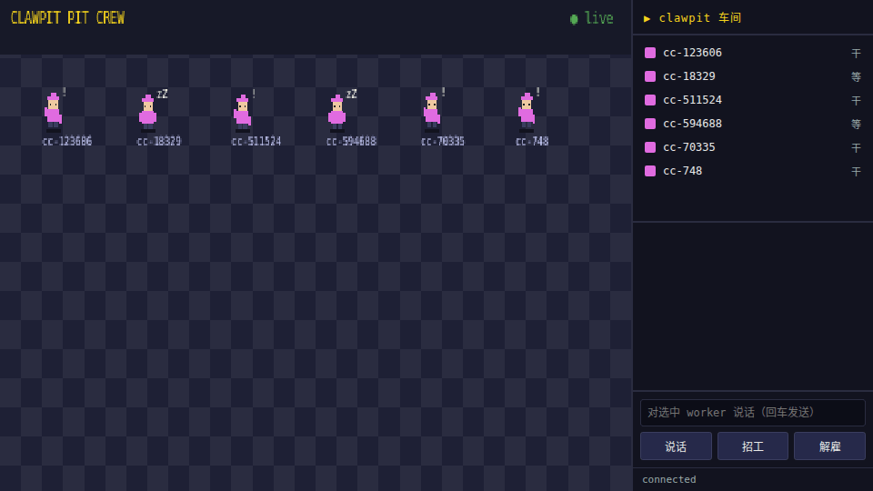

<div align="center">

# clawpit

**像素风本地 agent 车间 —— 发现、指挥、对话你机器上的 AI 编码 agent**

*A pixel-art pit crew for the AI coding agents already running on your machine.*

[](https://github.com/hoosss/clawpit/actions/workflows/ci.yml)
[](#license)
[](https://www.rust-lang.org)



*画面里全是真实事件：紫色小人 = 正在运行的 Claude Code 会话（⚒=干活 / zZ=等输入），灰色的 sp-1 是演示中现场招的新 worker，白气泡是真实投递的消息。*

</div>

---

## 它解决什么问题

你开着好几个终端跑 Claude Code / Codex / Gemini，但它们互相看不见、你也没法一眼看清谁在干嘛。clawpit 是一个本地 daemon：

| 能力 | 说明 |
|------|------|
| 🔍 **发现** | 自动感知本机正在运行的 agent 会话（/proc 扫描）；`CLAWPIT_AGENTS=zcode,…` 零改码收编任意 CLI；按 session id 导入历史会话也行 |
| 👁 **观察** | 解析 transcript 推断**真实状态与任务标题**（Claude Code / Codex）：在想 / 在调工具 / 在等你说话，名牌直接显示"正在干什么" |
| 🗣 **指挥** | 对任意 agent 喊一句话——hub 宿主写 stdin，外部 tmux 会话走 send-keys，真身继续干活；投递去向如实回报（stdin / tmux / 收件箱） |
| 💬 **中转** | agent 之间通过内置 MCP server 互相发消息（reviewer↔fixer 闭环的地基），对话以气泡上墙、档案留存 |
| 🏭 **房间** | 多车间隔离：房间切换 / 右键移人 / 按房招工；消息按 id 全局直达——**既隔离又互通** |
| 💾 **持久化** | 事件日志（`~/.clawpit/events.jsonl`）追加落盘，重启后房间结构、成员归属、最近聊天完整恢复 |
| 🖥 **三端** | TUI（ratatui）· Web 矢量像素车间（SVG 高清渲染，浏览器开箱即用）· HTTP API，同一套场景协议 |

## 快速开始

```bash
git clone https://github.com/hoosss/clawpit && cd clawpit
cargo run -p clawpit      # 终端 1：daemon（TUI + Web + API 三合一）
cargo run -p clawpit-tui  # 终端 2：像素车间，q 退出
```

浏览器打开 **http://localhost:7664** 就是上面的像素车间（SVG 矢量渲染，任意缩放高清不糊）。在任意终端跑一个 `claude`，几秒内它会作为一只 worker 走进画面（紫色安全帽 + 当前任务名牌），退出即消失。

**Web 操作**：房间 chips 切换/新建（`＋`）· 右键小人或名单移房 · 选人后说话/招工/解雇/档案 · provider 下拉选招工类型

**TUI 按键**：`j/k` 选人 · `⏎` 喊话 · `n` 招工 · `x` 解雇 · `q` 退出

**HTTP**：

```bash
# 招工 / 喊话 / 邮局
curl -X POST localhost:7664/agents -H 'content-type: application/json' \
  -d '{"provider":"claude_code"}'                # 招一只 claude
curl -X POST localhost:7664/msg -H 'content-type: application/json' \
  -d '{"from_pid":null,"to":"cc-1234","text":"复审通过"}'   # 走邮局，返回含 delivered 投递去向

# 房间
curl -X POST localhost:7664/rooms -H 'content-type: application/json' -d '{"name":"重构间"}'
curl -X POST localhost:7664/agents/cc-1234/move -H 'content-type: application/json' -d '{"to":"rm-1"}'
curl -X PATCH localhost:7664/rooms/rm-1 -H 'content-type: application/json' -d '{"archived":true}'

# 档案 / 收编任意 CLI
curl localhost:7664/agents/cc-1234/history?limit=20
CLAWPIT_AGENTS=zcode,qwen-code cargo run -p clawpit   # 长尾 agent 零改码入列
```

## 让 agent 互相聊天（MCP）

跑 `clawpit mcp` 打印各家 CLI 的现成配置（自动探测 clawpit-mcp 绝对路径）：

```bash
clawpit mcp          # Claude Code / Codex / 通用 MCP 三种片段
```

配上后 agent 获得 `clawpit_list` / `clawpit_send` / `clawpit_inbox` 三个工具。身份零配置：MCP 进程用父 pid 自报——谁拉起我，我就是谁。之后 reviewer 完成后一句 `clawpit_send("fixer", "清单已出，开工")`，消息直接出现在对方会话里（或收件箱），气泡同时上墙。

> **投递语义（重要）**：消息去向分三种——hub 宿主（stdin 注入）、tmux 里的外部会话（send-keys 注入，即发即达）、其余（进收件箱，agent 调 `clawpit_inbox` 才取到，拉模式）。Web 界面会如实标注去向；要即发即达，把终端跑在 tmux 里或用「招工」直管。

## 架构

```
clawpit-tui (ratatui) ─┐                      ┌─ HTTP API
                      ├─ WS 场景协议 ─────────┤
clawpit-web (SVG) ─────┘  (clawpit-scene)     └─ clawpit-mcp (MCP server)
                              │
                        clawpit daemon
   注册表·房间 · 扫描器 · pty 宿主 · 消息总线 · tmux 桥 · 观察站 · 事件日志
```

| crate | 职责 |
|-------|------|
| `clawpit-scene` | 场景模型与 WS 线协议（只增不改，serde default 兼容） |
| `clawpit` | daemon：`clawpit`（hub）+ `clawpit-mcp`（MCP server）两个二进制 |
| `clawpit-tui` | 终端渲染端 |
| `clawpit-web/` | 单文件 SVG 矢量像素车间，`include_str!` 编译期内嵌，零构建 |

注入路由：hub 宿主 → 写 stdin；外部会话在 tmux 里 → send-keys；其余 → 收件箱（取走即清）。

持久化：所有房间/成员/聊天事件追加进 `~/.clawpit/events.jsonl`（`CLAWPIT_HOME` 可改），启动重放重建；pty worker 不复活（进程已死），外部会话归属照旧。

## 路线图

- [x] **M0** 发现 + 状态墙 + 场景协议
- [x] **M1** pty 宿主 spawn + stdin 指挥
- [x] **M2** MCP 消息总线，agent 互聊
- [x] **M3** 真实状态解析（transcript）+ tmux 注入 + session 导入
- [x] **M4** Web 像素车间
- [x] **M5** 开源化（双协议 / CI / 贡献指南）
- [x] **M6** 矢量高清重绘 · 任务名牌 · 房间系统 · 事件日志持久化 · 会话档案 · 通用 agent 接入（`CLAWPIT_AGENTS`）· Codex 状态观察 · 投递透明化
- [ ] Tauri 桌面壳（按需）· crates.io 发布 · gemini/aider/opencode 状态观察

## 贡献

见 [CONTRIBUTING.md](CONTRIBUTING.md)——包括新 provider 的适配三步法。

## License

MIT OR Apache-2.0，双协议任选，见 [LICENSE-MIT](LICENSE-MIT) / [LICENSE-APACHE](LICENSE-APACHE)。
